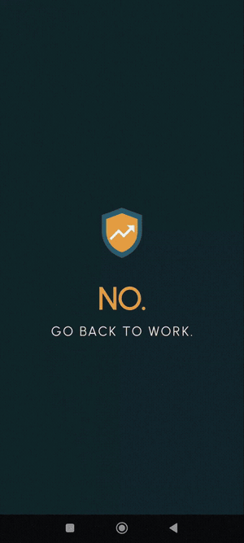
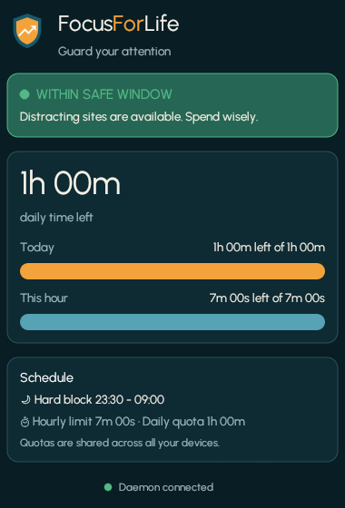
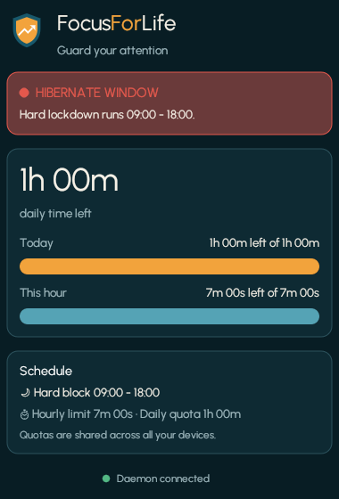

  

# FocusForLife

A self-hosted, cross-device distraction blocker that is deliberately hard to
bypass. One shared time budget across your computer and your phone: when your
daily quota is gone, it's gone **everywhere**.

This is a **build-from-source** project. The blocklists are compiled into the
binaries, so unblocking something in a weak moment requires editing a file and
rebuilding — not flipping a toggle. The friction is the point.

> **New here? Start with [docs/GETTING_STARTED.md](docs/GETTING_STARTED.md)** — one
> walkthrough from a fresh clone to a working blocker on desktop and/or phone, with
> optional cross-device sync at the end.

## See it in action

Open a blocked app and you're kicked out instantly — no grace period, no "just 5
more minutes." Reopen it ten times and it blocks all ten.

  

The desktop companion enforces the same shared budget and shows your status at a
glance — green while you have time, red during a hard-block window:

  
  &nbsp;&nbsp;
  

## What's in here

| Directory | Platform | What it does |
| --- | --- | --- |
| [`desktop/`](desktop) | Linux (+ Windows daemon) | Rust daemon: DNS-level domain blocking, focused-tab tracking, rule engine (daily quota, hourly limits, hard-block windows), systemd/boot integration. |
| [`android/`](android) | Android 15+ | Kotlin app: blocks apps via Accessibility Service and domains via a local VPN DNS sinkhole, with a blocking overlay and uninstall resistance. |

Each platform has its own README with build instructions and a guide to
customizing what gets blocked:

- [Desktop README](desktop/README.md)
- [Android README](android/README.md)

## The timer model

All platforms enforce the same rules against the same clock:

- **Daily quota** — a fixed budget of minutes per day across all blocked targets.
- **Hourly bucket** — a per-clock-hour limit; exhaust it and you're in cooldown
  until the next hour.
- **Hard-block window** — a time range (e.g. 23:00–11:00) where everything on
  the list is blocked outright.
- **Free-time windows** — scheduled exceptions (evening, afternoon break).

## Cross-device sync (optional)

Devices can share one usage budget through a Firebase Realtime Database you
host yourself, with locked-down rules ([`database.rules.json`](database.rules.json)).
Sync is **off by default** — with no credentials configured, every device runs
standalone. Setup walkthrough: [`docs/firebase-setup.md`](docs/firebase-setup.md).

## Philosophy

- **Self-hosted.** No accounts on someone else's server, no telemetry. If you
  use sync, it's your own Firebase project.
- **High-friction by design.** Blocklists live in source files; changes require
  a rebuild. Device-admin and boot-service integration resist casual disabling.
- **Same rules everywhere.** One rule engine model, one hour-stamp formula,
  shared budget.

## License

[MIT](LICENSE) — see [CONTRIBUTING.md](CONTRIBUTING.md) if you'd like to help.
