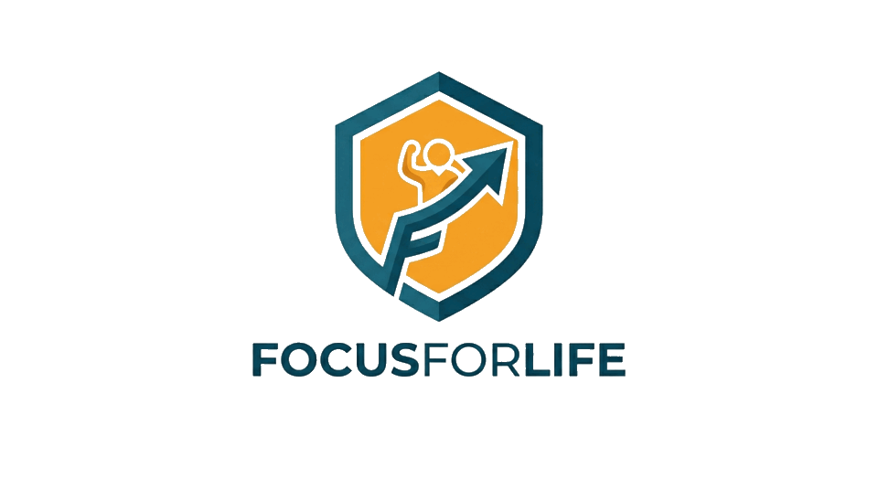

<p align="center">
  
</p>

# Getting Started

This is the one page to read first. It takes you from a fresh clone to a working
blocker on your computer and/or phone, and points you to the deeper per-platform
docs only when you need them.

FocusForLife is **build-from-source on purpose**. The blocklist is compiled into
the binaries, so unblocking something in a weak moment means editing a file and
rebuilding, not flipping a switch. If that sounds like overkill, it is, and that
is the point.

---

## 1. Decide what you actually want

You don't have to set up everything. Pick the smallest thing that helps you.

```
            ┌─ Just my computer?      → do PART A (Desktop)
What do I   ├─ Just my phone?         → do PART B (Android)
want to     ├─ Both, independent?     → do PART A and PART B
block?      └─ Both, ONE shared       → do PART A + PART B + PART C (Sync)
              time budget?
```

**Sync is optional and off by default.** With no Firebase credentials configured,
every device just enforces its own quota and never touches the network for sync.
Only do **Part C** if you want one shared budget across devices (e.g. the hour you
burn on your phone also comes off your laptop's allowance).

| You want | Parts | Extra accounts needed |
| --- | --- | --- |
| Desktop blocker | A | none |
| Phone blocker | B | none |
| Both, separate budgets | A + B | none |
| Both, one shared budget | A + B + C | one free Firebase project (yours) |

---

## 2. Get the code

```bash
git clone https://github.com/tahaKaroui/focusforlife.git
cd focusforlife
```

| Directory | What it is |
| --- | --- |
| [`desktop/`](../desktop) | Rust daemon for Linux (and a Windows daemon). DNS-level domain blocking + rule engine. |
| [`android/`](../android) | Kotlin app. Blocks apps (Accessibility) and domains (local VPN DNS sinkhole). |
| [`docs/`](.) | This guide, the Firebase walkthrough, and install/runtime notes. |

---

## PART A — Desktop (Linux)

**Prerequisites**

- A recent stable **Rust** toolchain (`cargo --version` should work). Install from
  <https://rustup.rs> if needed.
- **ActivityWatch** + its browser extension is recommended for accurate
  focused-tab tracking. Without it the daemon falls back to a Chrome DevTools
  check, but AW gives the cleanest "what tab am I really on" signal.
- DNS-based blocking and the boot/service wiring are covered in
  [`desktop/README.md`](../desktop/README.md) and
  [`desktop/docs/systemd-install.md`](../desktop/docs/systemd-install.md).

**Steps**

1. **Build.**
   ```bash
   cd desktop
   cargo build --release        # binary: target/release/ffl-daemon
   ```

2. **Choose what to block.** Edit the plain-text list, one domain per line, no
   `https://`:
   ```bash
   $EDITOR config/blocked-domains.txt
   ```
   `twitch.tv` also covers `*.twitch.tv`. Leave the DNS-resolver entries at the
   bottom alone (they stop apps from tunnelling around the block).

3. **Make your own config** (never edit the tracked `example.toml`):
   ```bash
   cp config/example.toml config/linux.local.toml
   $EDITOR config/linux.local.toml      # set quota, hourly limit, hard-block window
   ```
   `config/*.local.toml` is gitignored, so your real config never gets committed.

4. **Run it.**
   ```bash
   ./target/release/ffl-daemon --config config/linux.local.toml
   ```
   To run at boot as a service, follow
   [`desktop/docs/systemd-install.md`](../desktop/docs/systemd-install.md).

**Verify:** open a blocked site. Within a second or two the daemon should block it,
and the `ffl-ui` window should flip to the matching status (Hibernate / cooldown /
quota). If you skipped sync, the footer will read "Daemon connected" and quotas are
purely local.

---

## PART B — Android

**Prerequisites**

- **Android Studio** (or a standalone Android SDK) and a device on **Android 15
  (API 35)** or newer.
- USB debugging enabled on the phone. On Xiaomi/MIUI/HyperOS you also need
  **"USB debugging (Security settings)"** enabled (requires a Mi account + SIM)
  if you want the optional self-heal grant in step 5.

> **Heads up — the Firebase build trap.** The Android module applies Google's
> `google-services` plugin, which **fails the build if `app/google-services.json`
> is missing** — even if you never want sync. So before your first build you must
> EITHER do Part C (which creates that file), OR drop a placeholder
> `google-services.json` from any throwaway Firebase project into `android/app/`.
> Without one of those, `./gradlew` will not produce an APK. (Making this truly
> optional is tracked as a future improvement.)

**Steps**

1. **Point Gradle at your SDK.** Create `android/local.properties`:
   ```properties
   sdk.dir=/absolute/path/to/Android/Sdk
   ```
   Android Studio writes this for you if you open the project there.

2. **Choose what to block.** Everything lives in one file:
   ```
   android/app/src/main/java/dev/focusforlife/android/core/FocusTargets.kt
   ```
   - `blockedDomains` — bare domains, e.g. `"reddit.com"`.
   - `blockedAppPackages` — app **package names**, e.g. `"com.instagram.android"`.
     Find a package name from its Play Store URL (`...?id=<package>`), a
     "package name viewer" app, or `adb shell pm list packages | grep -i <name>`.

   Keep each entry quoted and comma-separated exactly like the existing lines, a
   stray comma fails the build.

3. **Build & install** onto a connected phone:
   ```bash
   cd android
   ./gradlew installDebug
   ```

4. **Grant the runtime permissions.** On first launch the app walks you through
   them; grant all of them or enforcement is incomplete:
   - **Accessibility Service** — detects and blocks foreground apps.
   - **VPN** — local DNS sinkhole for blocked domains (no traffic leaves the phone).
   - **Display over other apps** — the blocking overlay.
   - **Ignore battery optimization / exact alarms** — keeps it alive in the background.

5. **(Optional but recommended) Enable self-heal.** Granting one extra permission
   lets the app rebind its own accessibility service after an aggressive task-kill
   (e.g. MIUI "clear all"), instead of going dead until you toggle it by hand:
   ```bash
   adb shell pm grant dev.focusforlife.android android.permission.WRITE_SECURE_SETTINGS
   ```
   The dashboard's **Self-Heal** row turns green once this is granted.

**Verify:** open a blocked app. You should be kicked to the "GO BACK TO WORK."
screen instantly. Swipe the app from recents and reopen it — it should still
block, and the app's own services should survive the swipe.

---

## PART C — Cross-device sync (optional)

Only needed if you want **one shared time budget** across your devices. Each user
hosts **their own** free Firebase Realtime Database; nobody shares a central
server, and your data is locked to your account by the database rules.

The full walkthrough is in **[`docs/firebase-setup.md`](firebase-setup.md)**. In
short:

1. Create a Firebase project, enable **Realtime Database** and **Email/Password
   auth**, and add one shared login that every device signs in with.
2. Publish the locked-down rules from
   [`database.rules.json`](../database.rules.json).
3. **Desktop:** fill the `[sync]` block in your `*.local.toml` (DB URL, web API
   key, the shared email/password, a unique `device_id`).
4. **Android:** add an Android app to the Firebase project, download its
   `google-services.json` into `android/app/`, and put the shared email/password +
   DB URL in `android/local.properties`. Rebuild.

With the credentials present, devices write their own usage node and sum the
others' on read, so the quota adds up everywhere (with up to one sync interval,
~10s, of lag). With the credentials absent, everything runs standalone.

---

## Troubleshooting first-run gotchas

| Symptom | Cause | Fix |
| --- | --- | --- |
| `google-services.json is missing` build error | The Firebase plugin needs that file even for standalone | Do Part C, or drop in a placeholder `google-services.json` |
| `SDK location not found` | No `android/local.properties` | Add `sdk.dir=...` (Part B step 1) |
| Accessibility shows "Not working. Tap for info" after a task-kill | Service unbound, no self-heal permission | Grant `WRITE_SECURE_SETTINGS` (Part B step 5) |
| App dies on reboot / gets killed in background (Xiaomi) | MIUI autostart + battery limits | Enable Autostart for the app and set battery to "No restrictions" |
| Desktop UI says "Daemon offline" | `ffl-daemon` isn't running | Start it, or check `systemctl status ffl-daemon` |
| Blocked time barely counts on desktop | ActivityWatch / its browser extension not running | Install/enable AW + the web-watcher extension |

---

## Where to go next

- [Desktop README](../desktop/README.md) — full build, customization, DNS notes.
- [Android README](../android/README.md) — customization and permission detail.
- [Firebase setup](firebase-setup.md) — the complete sync walkthrough.
- [Boot/service install](../desktop/docs/systemd-install.md) — run at startup.
- [Contributing](../CONTRIBUTING.md) — if you want to help.
